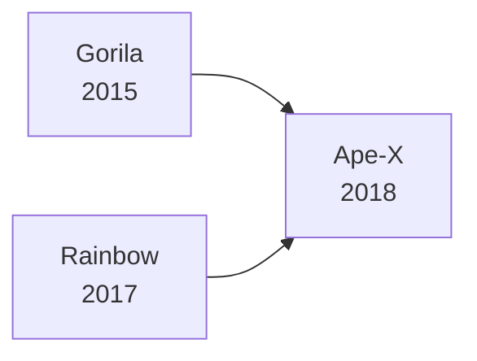

元論文: [[1803.00933v1] Distributed Prioritized Experience Replay (arxiv.org)](https://arxiv.org/abs/1803.00933v1)

>[!abstract]
> - 分散強化学習の有名な手法
> - Rainbow をベースとして、さらに複数のエージェントを別のCPUで独立に行動させて、経験データを集めながら学習を行う。

## Motivation
深層学習はより多くの計算とより強力なモデル、およびより大きなデータセットを組み合わせることでより印象的な結果が得られる。これは深層強化学習でも同様の原理が当てはまるはず。
そこで、分散処理を施すことで、より多くのデータを生成して、そこから優先順位付けされた方法で選択することで、深層強化学習をスケールアップさせる。このアーキテクチャを使用して、DQN と DDPG をスケールアップする。

## Background
### Distributed Stochastic Gradient Descent
Distributed Stochastic Gradient Descent(分散確率的勾配降下法)は、パラメータの更新に使用される勾配の計算を並列化することで、DNN の学習を高速化する。
Gorila は分散非同期パラメータ更新と分散データ生成を深層強化学習に適用した。
### Distributed Importance Sampling
重要度サンプリングは、分散を減少させることで学習を高速化させる手法のことである。
データセットから不均一にサンプリングし、サンプリング確率に従って更新を重み付けして、それによって生じるバイアスを打ち消すと、勾配の分散を減らして収束速度を上げることができる。
例えば、対応する勾配のL2ノルムに比例する確率でサンプルを選択したり、サンプルを最新の損失値でランク付けして、損失そのものではなくランクの関数としてサンプリング確率を設定するなどをする。
このアプローチの本質は、学習によってより重要な(情報量が多い)サンプルを頻繁に選択することで、学習の効率を上げることである。ただし、偏りが発生しないように、サンプリング確率に基づいて更新の重みを調整する必要がある。
### Prioritized Experience Replay
経験再生は、経験 $E_{t}=(S_{t}, A_{t}, R_{t}, S_{t+1})$ をバッファに保存して、学習時にバッファから経験データをランダムに取り出して用いる技術である。このとき、ランダムにではなく、優先度に応じて選ぶのが、Prioritized Experience Replay である。
このアプローチは、重要度サンプリングに強く関連しているが、最も「驚くべき」経験を学習することに焦点をあてている。
## Contribution
Prioritized Experience Replay を分散環境に拡張する。このアプローチを Ape-X と呼ぶ。
![[Pasted image 20240824204313.png]]
それぞれが独自の環境インスタンスを持つ複数の Actor が経験を生成し、それを共有経験再生メモリに追加し、データの初期優先度を計算する。

![[assets/Pasted image 20240824204420.png]]

ここでは、環境を通じてステップを進め、DNNとして実装されたポリシーを評価する。そして、観察されたデータを再生メモリに保存する。

![[assets/Pasted image 20240824204711.png]]
ここでは、再生メモリからデータのバッチをサンプリングし、そのデータを使用してポリシーのパラメータを更新する。
この実験では、数百の Actor が CPU上で実行してデータを生成し、GPU上で実行される一つの Learner が最も有用な経験をサンプリングする。
>[!question] Gorila との違い
> Gorila では各 Actor が独自のリプレイメモリを持っていたが、Ape-X では一つの一元化された再生メモリを使用している。
> また、Gorila が一様サンプリングを使用していたのに対し、Ape-X は Prioritized Experience Replay を採用している。これにより、最も有用なデータをより頻繁にサンプリングし、学習に使用することができる。

Prioritized Experience Replay を用いた DQN では、新しい遷移(経験)の優先度を、これまでに確認できた最大の優先度で初期化され、サンプリング後にのみ更新された。これは分散処理を採用し多数の Actor を使用する Ape-X ではうまくスケールしない。本論文でのアーキテクチャでは、 Actor が優先順位を更新するのを待つと、最新のデータが最大の優先度を持ってしまって、そこにのみ注目してしまう偏りが生じる。

- [ ] ここちょっとよくわかってないのでしっかり考える

そこで、代わりにApe-X の Actor が既に行っている計算を利用して、ポリシーのローカルコピーを評価し、オンラインでの新しい遷移に適した優先度を計算するようにする。これによって、再生に入るデータの優先順位が、追加コスト無しでより正確になる。

## experiments
### Atari

