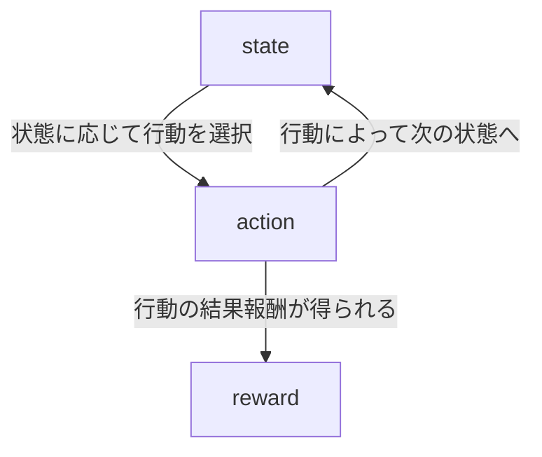

プレイリストのリンク: [強化学習の探検 - YouTube](https://www.youtube.com/playlist?list=PLhDAH9aTfnxI1OywfnxXCDTWGtYL2NxJR)

## 強化学習は行動選択の科学である
強化学習の目的は収益の最大化である。そのために、状態に応じてどのような行動を選択するのかを学習する。
>[!example] 例
> - そばうちロボット
> 	- おいしさ(収益)を最大にするために、その日の天候や生地の具合(状態)で作業を調整する(行動の選択)。
> - 動画サイトのレコメンド
> 	- 総視聴時間(収益)の最大化のために、ユーザーの好みや視聴履歴(状態)に応じて、推薦する動画を決める(行動の選択)。
> - 囲碁・将棋
> 	- 対局に勝つために(勝率が収益)局面(状態)に応じて打ち手を選択する。

## 教師あり学習との類似点と相違点
### 類似点
教師あり学習はデータに対してラベルを推論し、正解率を高めることが目標である。一方、強化学習では状態に応じて行動を選択し、収益を高める。
### 相違点
1. 強化学習では、状態・行動のあとに"次の状態"が来る。各状態には相関があるということが教師あり学習との大きな違いである。(教師あり学習では各ラベルは独立)
2. 収益がわかるまで時間差が存在する。

これらの相違点は、解こうとしているタスクの難易度に由来する。
また、部分問題がたくさん存在することも強化学習の難しさの一つである。教師あり学習はデータ→ラベルの予測を学習すればいい。強化学習の場合、

- 行動→収益: Q-learning
- 状態→行動: policy-network
- 状態→収益: value-network

など、何から何を学習しているのか混乱しやすい。

## 強化学習の全体像
強化学習の目的は、収益最大化のために状態(state)に応じて行動(action)を選択することである。状態に応じて行動を選択し、行動によって次の状態へというループを繰り返す。このとき、行動の結果として報酬(reward)が得られる。収益とは報酬の合計のことである。state と action は制御できるが、reward を制御することはできない。

>[!example] 収益の例
>- 動画サイトのレコメンドの場合、毎回の推薦のあと、報酬(その動画の視聴時間)がもらえて、その合計が収益になる。
>- 囲碁・将棋だと、対局の終了時に勝ち負けの報酬が得られる。

行動を選択して報酬を受け取り、その学習を通じてより最適な(より多くの報酬を受け取る)行動選択を編み出すのが強化学習の大まかな流れである。

## マルコフ決定過程
マルコフ決定過程(Markov Decision Process: MDP) は、強化学習の問題設定を数学的に定式化するものである。環境(environment)と呼ばれることもある。

マルコフ決定過程は5つの要素からなる。以下に肝となる部分を紹介する。
(1) 状態→次の状態
行動に応じて次の状態が決まる。マルコフ決定過程では、
$$
   p(s'|s,a)
$$
で表現する。
(2) 行動→報酬
行動の結果、報酬が得られる。マルコフ決定過程では、
$$
p(r|s,a)
$$
で表現される。
>[!important] MDP の肝
>マルコフ決定過程では、行動の次の状態、報酬を条件付き確率 $p(s'|s,a), p(r|s,a)$ で設定している。

最後に、マルコフ決定過程の厳密な定義を示す。
> [!check] マルコフ決定過程の定義
(1) 状態の集合 $\mathcal{S}$
(2) 行動の集合 $\mathcal{A}_{s}$
(3) 状態遷移の確率 $p(s'|s,a)$
(4) 報酬の確率 $p(r|s,a)$
(5) 初期状態の確率 $p(s_{0})$

## 方策
強化学習は収益最大化のために状態に応じて行動を選択する。この「状態に応じて行動を選択する」というのを担うのが方策である。数式化すると、
$$
\pi(a|s)
$$
のように書ける。

>[!question] なぜ方策は確率分布で表現される?
> 1. MDP が確率を用いて定義されるので、方策も確率的な概念を用いるのが自然である。
> 2. データ収集の際には、最善以外の行動も重要である。
> 3. 確率分布で考えることで、連続的な行動を扱うことができる。

## 収益
### エピソードと軌跡
MDP によると、まず初期状態が $p(s_{0})$ に従って決まる。そこから行動を選択し、その行動によって報酬・次の状態が決まる。方策は確率で表現されるため、$s_{0}, a_{0}, r_{0},s_{1},a_{1},r_{1}\dots$ は全て確率的に決定する。このようにして得られたデータから、状態・行動・報酬の確率分布が決まっていく。
なお、この系列データ全体を軌跡(trajectory)といい、有限の軌跡をエピソード(episode)という。
### 収益と価値関数
収益は、強化学習での最適化の対象である。収益 $g$ は、各地点の報酬 $r_{t}$ を用いて以下のように計算される。

$$
g=\sum_{t\geq 0} r_{t}
$$
ただし、$g$ の最大化はやりづらい。なぜならば、$r_{t}$ は確率的(random)に変動するためである。そこで、期待値に変換して最大化するのが一般的である。
$$
E[G]=E\left[ \sum R_{t} \right] = \sum_{t\geq 0}E[R_{t}]
$$
期待収益は無限に発散するかもしれない。そのため、上記の期待値に、割引率 $\gamma$ を導入することで発散するものを収束させる。これを期待割引収益という。
$$
E[G] = \sum_{t\geq 0}\gamma^t E[R_{t}]
$$
>[!question] 割引率を導入して良い理由
>- 強化学習は工学なので、うまく学習できればOK。実際、問題に合わせた割引率を設定すれば学習を効率化できる。
>- 経済学的に自然な操作だからである。
>	- 金利が1%の状況を考える。今年の100万円は1年後には101万円になる。逆に、1年後の100万円は今日の100万円×$\frac{100}{101}$ になる。これを続けると、$t$ 年後の100万円は今日における100万円×$(\frac{100}{101})^t$ 円である。これは割引率の概念と同じ。
>	- 実際、レコメンドでも今日のクリックを30年後のクリックと同じ扱いはできないので、割引率を用いて直近の数値を重視すべき。

そこで、強化学習では収益とは一般に期待割引収益を指すことが多い。

## 価値関数
### 価値関数とは?

>[!Help] 記号のおさらい
>$s_{t},a_{t},r_{t}$: 時刻 $t$ での状態、行動、報酬の値
>$S_{t},A_{t},R_{t}$: 時刻 $t$ での状態、行動、報酬の確率変数

期待割引収益に $S_{0}=s$ の条件をつけることで、状態価値関数になる。
$$
V^{\pi}(s)=E^{\pi}[G|S_{0}=s]
$$
これは、状態が $s$ であるときにもらえる収益の期待値を表す。つまり、状態価値関数はその状態の良さを表現することができる。

状態価値関数に $A_{0}=a$ の条件をつけることで、行動価値関数になる。
$$
Q^{\pi}(s,a) = E^{\pi}[G|S_{0}=s, A_{0}=a]
$$

これは、状態が $s$ のときに行動 $a$ をとったときにもらえる収益の期待値を表す。つまり、行動価値関数はその行動の良さを表現することができる。
価値観数のメリットは、方策 $\pi$ の学習と並行して価値関数も学習することで効率的に学習できるということがある。

## GPI と構造図
### Generalized Policy Iteration
Generalized Policy Iteration は、方策改善(Policy Improvement)と方策評価(Policy Evaluation)の繰り返しを表す。方策改善ではパラメータを変えて $\pi$ を改善し、方策評価では価値関数 $V^{\pi}, Q^{\pi}$ の推定(学習)を行う。
### 強化学習の4つの対象
強化学習ではデータ、方策、価値関数、MDPを駆使して学習を行う。

## ベルマン期待方程式
>[!important] ベルマン期待方程式の定理
>方策 $\pi$ の価値関数 $V^{\pi}(s), Q^{\pi}(s,a)$ は以下の式を満たす。
>$$
>V^{\pi}(s)=\sum_{a}\pi(a|s)\left( \sum_{r}p(r|s,a)r+ \gamma \sum_{s'}p(s'|s,a)V^\pi (s') \right)
>$$
>$$
>Q^{\pi}(s,a)=\sum_{r}p(r|s,a)r+\gamma\sum_{s'}p(s'|s,a)\sum_{a'}\pi(a'|s')Q^{\pi}(s',a')
>$$

### ベルマン期待方程式の正体
#### Step1: 状態の次は行動
$V^{\pi}(s)$ は、$S_{0}=s$ のときの収益を表す状態価値関数である。状態がわかっているならば、次には行動が起こる。行動 $a$ が確率 $\pi(a|s)$ で選択され、収益 $Q^{\pi}(s,a)$ を受け取る。これを式で表現すると、以下のようになる。
$$
V^{\pi}(s)=\sum_{a}\pi(a|s)Q^{\pi}(s,a)
$$
#### Step2: 行動の次は報酬と次の状態
$Q^{\pi}(s,a)$ は、$S_{0}=s,A_{0}=a$ のあとの収益を表す行動価値関数である。行動をしたあとには報酬と次の状態が得られる。そのため、行動価値関数は、はじめの報酬 $R_{0}$の期待値と $S_{1}=s’$ 以降の収益の和で表現される。
$$
Q^{\pi}(s,a)=\sum_{r} p(r|s,a)r+\gamma \sum_{s'}p(s'|s,a)V^{\pi}(s')
$$
step1 と step2 の式を整理することで、ベルマン期待方程式の定理が得られる。

## ベルマン最適方程式
### 最適方策
いい感じのMDPには最適方策 $\pi^{\ast}$ という方策があって、全ての状態、行動について価値関数が最大になる。強化学習の究極の目標は最適方策の発見である。
$V^{\pi^{\ast}}(s)$ : 最適状態価値関数
$Q^{\pi^{\ast}}(s,a)$ : 最適行動価値関数
これらの最適価値関数に関するベルマン方程式がベルマン最適方程式である。

>[!important] ベルマン最適方程式の定理
>最適方策 $\pi^{\ast}$ についての価値関数 $V^{\ast}, Q^{\ast}$ は以下の式を満たす。
>$$
>V^{\pi^{\ast}}(s)=\max_{a}\left( \sum_{r}p(r|s,a)r+ \gamma \sum_{s'}p(s'|s,a)V^\ast (s') \right)
>$$
>$$
>Q^{\ast}(s,a)=\sum_{r}p(r|s,a)r+\gamma\sum_{s'}p(s'|s,a)\max_{a'}Q^{\ast}(s',a')
>$$

### ベルマン最適方程式の正体
#### Step1: 状態の次は行動
$V^{\pi}(s)$ は、$S_{0}=s$ のときの収益を表す状態価値関数である。状態がわかっているならば、次には行動が起こる。行動 $a$ が確率 $\pi(a|s)$ で選択され、収益 $Q^{\pi}(s,a)$ を受け取る。これを式で表現すると、以下のようになる。
$$
V^{\pi}(s)=\sum_{a}\pi(a|s)Q^{\pi}(s,a)
$$
最適方策 $\pi^{\ast}$ の場合は、$Q^{\ast}(s,a)$ が最大となる行動 $a$ を必ず選択する。なぜならば、それ以外の行動を選択すると収益が減り、最適ではなくなってしまうからである。
$$
V^{\ast}(s)=\max_{a}Q^{\ast}(s,a)
$$
#### Step2: 行動の次は報酬と次の状態
$Q^{\pi}(s,a)$ は、$S_{0}=s,A_{0}=a$ のあとの収益を表す行動価値関数である。行動をしたあとには報酬と次の状態が得られる。そのため、行動価値関数は、はじめの報酬 $R_{0}$の期待値と $S_{1}=s’$ 以降の収益の和で表現される。
$$
Q^{\pi}(s,a)=\sum_{r} p(r|s,a)r+\gamma \sum_{s'}p(s'|s,a)V^{\pi}(s')
$$
こちらも同様に最適方策 $\pi^{\ast}$ の場合は $V^{\ast}(s')$ が最大になる状態を選択する。
$$
Q^{\pi}(s,a)=\sum_{r} p(r|s,a)r+\gamma \sum_{s'}p(s'|s,a)V^{\ast}(s')
$$

step1 と step2 の式を整理することで、ベルマン期待方程式の定理が得られる。

## 方策反復法
### 方策反復法とは
>[!important] 方策反復法の特徴
>- 方策評価と方策更新の繰り返しで最適方策 $\pi^{\ast}$ を得る
>- MDP 既知の場合に使える
>	- ボードゲームのAI作りなどに利用
>- 状態数が大きすぎないときに利用可
>	- 具体的には、このサイズの行列積を繰り返しても大丈夫なくらい
>- data 集めはせず、MDP から $\pi^{\ast}$ を直接作成する

多くの強化学習アルゴリズムが方策評価と方策更新の繰り返しで学習を進めていく。そのため、方策反復法には強化学習の肝が含まれている。

### 方策評価
方策評価は価値観数の推定を表す。方策反復法では状態価値関数 $V^{\pi}(s)$ を推定する。状況としてはMDP既知で方策 $\pi$ が与えられたときに、状態価値関数 $V^{\pi}(s)$ を計算したい。そこでベルマン方程式を用いる。
$$
V^{\pi}(s)=\sum_{a}\pi(a|s)\left( \sum_{r}p(r|s,a)r+ \gamma \sum_{s'}p(s'|s,a)V^\pi (s') \right)
$$
この中だと方策とMDPと割引率が既知なので、未知数は状態価値関数 $V^{\pi}(s)$ となる。つまり上式は状態価値関数の連立一次方程式であり、解くことによって状態価値関数が求まる。
#### ベルマン作用素
方策反復法の式は $\gamma <1$ のときは解がただ一つ存在する。一次方程式を解くための手法には逆行列の計算がある。しかし逆行列計算は行列のサイズが大きいと現実的な時間では終わらない。そんなときはベルマン作用素を用いる。ベルマン作用素はベルマン方程式を利用して推定値 $\hat{V}^{\pi}(s)$ を更新して精度を上げるものである。
$$
\hat{V}^{\pi,\text{new}}(s)=\sum_{a}\pi(a|s)\left( \sum_{r}p(r|s,a)+\gamma \sum_{s'}p(s'|s,a)\hat{V}^{\pi}(s) \right)
$$
この式を実行することで、誤差が $\gamma$ 倍に減る。
$$
\max\mid \hat{V}^{\pi,\text{new}}(s)-V^{\pi}(s) \mid \leq \gamma \max\mid \hat{V}^{\pi}(s) - V^{\pi}(s) \mid
$$
この式を充分な回数繰り返すことで状態価値関数の推定を行うことで、方策評価を完了する。

### 方策更新
方策評価によって状態価値関数の推定値 $\hat{V}^{\pi}(s)$ が得られた。これを用いて行動価値関数の推定値 $\hat{Q}^{\pi}(s,a)$ が得られる。
$$
\hat{Q}^{\pi}(s,a)=\sum_{r}p(r|s,a)r+\gamma \sum_{s'}p(s'|s,a)\hat{V}^{\pi}(s)
$$
新しい方策は、行動価値関数が最大となる方策を採用する。
$$
\pi^{\text{new}}=\underset{\pi} {\operatorname{argmax}}\hat{Q}^{\pi}
$$

